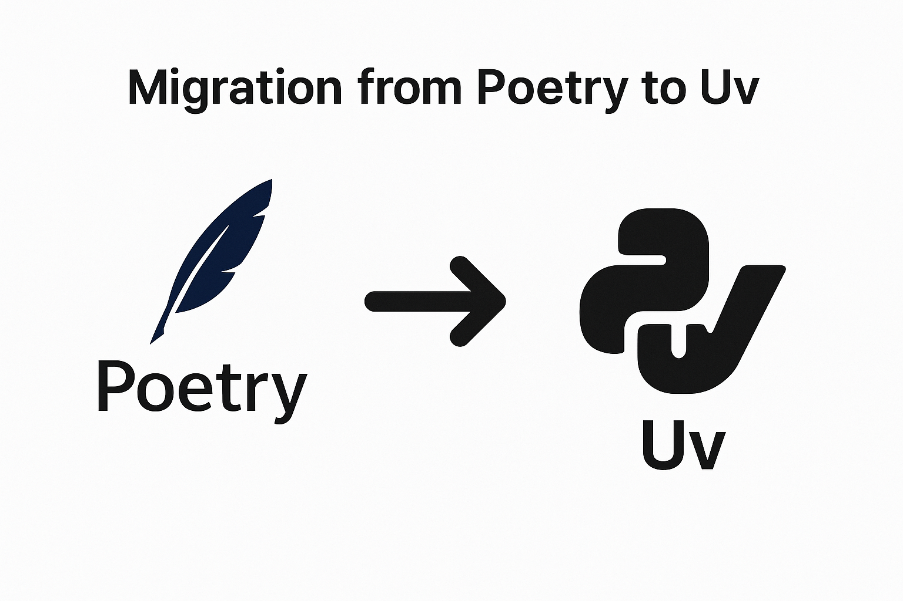

# Convert poetry to uv

{ style="width:230px" align=right}
When I encountered #uv I fell for it right away. I was already using ruff for a while and started looking into rye, which was the intermediate step before it became uv.

Creating a uv repo is easy, just run `uv init $project` and you are off to the races. Using it for new projects is easy if you are already used to poetry. The commands are quite similar. Just add a few libraries with `uv add $library` or `uv add --dev $library` to make it part of the development group.

<!-- more -->

Even loading libraries from your requirements file is easy, `uv add -r requirements.txt`.

Now, you might want to migrate other repositories to have some consistency.  How to migrate your existing repo's to uv. Doing it by hand is just plain annoying and it will be easy to sneak in some errors.

After I did that once, and imaging other would be in the same pickle. I thought it would be useful to have a migration script to convert the existing #poetry `pyproject.toml` to one that can be consumed by #uv.

I looked for existing ones, but didn't find any that met my requirements or desires. So, nothing to do than creating my own. And so it was born. [convert_poetry2uv](https://github.com/bartdorlandt/convert_poetry2uv)

to make it really easy to use, when you already have uv installed is just calling it directly:

    uvx convert-poetry2uv -n pyproject.toml

The `-n` flag will do a dry run and creates a new file instead of moving the old one out of the way, allowing you to verify its contents.
To do the actual migration, just:

    uvx convert-poetry2uv pyproject.toml

(Your original file will be backed up)

I hope this project will help you in your migrations and make them smooth and quick.

In case you run into challenges, don't hesitate to reach out.
