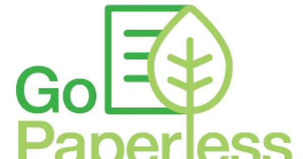
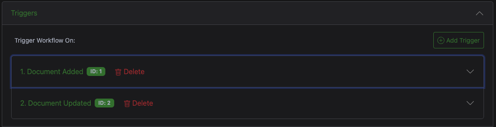
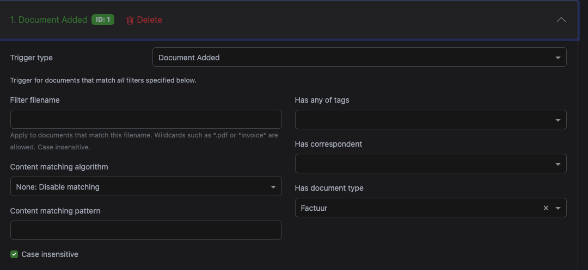
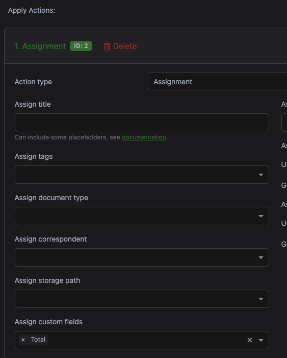

# Paperless

{ style="height:220px" align=right}

Recently I was helping out some friends with paperless, how to structure their documents, how to implement a flow for their documents, etc. On occasion this triggered me to look at how I use paperless myself. I've been using it for a while now and I'm very happy with it. I've also added some automation to it, which I'll share in this post.

<!-- more -->

## The start
Getting started with paperless is quite easy. The [documentation](https://docs.paperless-ngx.com/setup/) is good and will get you started quickly. I'm running it in a docker container, which is also described in the documentation. I'm running the `tika` variant with `postgres`. See the [docker-compose.yml](https://github.com/paperless-ngx/paperless-ngx/blob/main/docker/compose/docker-compose.postgres-tika.yml) for the details.


## Beautiful part

Let's skip right to the beautiful part. No matter how you start your setup with paperless, there is no wrong way. No matter how you start with tags, correspondents, document types or storage paths, you can always change them later. This is what I love about paperless. You can start with a simple setup and grow it as you go.

Even the storage path structure, which is already very flexible in paperless, can be changed later. Any change to it, will be reflected on the filesystem without any worries on failing.

Here are some examples of how I've structured my documents:

Contracts:
```jinja
contracts/{{ created_year }}/{{ correspondent }}/{{ created_year }}{{ created_month }}{{ created_day }}_{{ title }}
```

Invoices private:
```jinja
private/invoices/{{ created_year }}/{{ correspondent }}/{{ created_year }}{{ created_month }}{{ created_day }}_{{ title }}
```

## Algorithms

For all "things" in paperless, you can choose to have it done "automagically" or helping it out a little bit.

As with the storage paths, the matching can be done using it algorithms, these will start working after learning about a few (if I recall correctly, ~ 20 documents).

Otherwise, you can have it match on the presence of certain words, either exact or via regex, and some more options. I'd say, there is no best way, just your way of choosing how to use it.

The same logic applies to `tags`, `document types` and `correspondents`.

## Automation

I'll go into some of the internal automation as well as some external ones.

### Custom fields and workflows

For the invoices I've created a custom field `Total`. This is a `Monetary` field. I want this field to be present on any invoice.

This can be done manually, but where is the fun in that?

I've created a workflow that add the `total` field to the respective document type automatically. This is done by a trigger when a documented is added to the `invoices` category or when it is updated to it.



See an example below, note that `Factuur` is Dutch for `Invoice`.



In the "Actions" section you can assign the custom field `Total` to the document.




> Note: What this doesn't do:
> When it was incorrectly assigned to invoices, it will not remove the custom field. Though this is still easily done when processing your inbox.


### Email

I have set up a dedicated mailbox for paperless to monitor. Every hour paperless scan the mailbox for new mails. It will process the documents and add them to the database.

With this in place, I can just send/forward any mail. Quite useful! I didn't want to give it access to my private or work mailboxes, that is why I've setup up a dedicated mailbox.

Having the dedicated mailbox I can have some additional automation for it. When invoices are received to a specific alias, they will also be forwarded to my bookkeeping program, allowing me to process that email in both systems with a single action.

Therefore, depending on the alias, the document will be processed differently.


### Paperless app the phone

I've also set up the paperless app on my phone. This allows me to quickly scan documents and have them processed by paperless. I can also add tags, correspondents and categories to the document. This is quite useful when I'm on the go and want to process a document quickly.

Sharing documents from the browser is not really a quick option, you would need to download the file and take an action on it.

With the [application](https://apps.apple.com/nl/app/swift-paperless/id6448698521?l=en-GB) you can look at a document and quickly take an action on it. Including having your own shortcuts..

(I'm sure there is an app on Android as well)

### Shortcuts

I've created some shortcuts on my phone to quickly add a document to paperless or to email them to the different mail addresses for the various actions.

With these in place I'm able to quickly process documents, from the phone, tablet or laptop.

#### Add document to paperless with the API
Here is a [public shortcut](https://www.icloud.com/shortcuts/d234abc0885040129d9d75fa45fe1154) to add a file/pdf/image to paperless using the api. On the first run you will need to set the API key and the URL to your paperless instance.

This might be less useful on the phone, where you have the app, but it might be useful on the tablet or laptop.

#### Email documents with quick actions
Here is my [shortcut for sending a file to an email](https://www.icloud.com/shortcuts/585aaca1723047aa9d148f59f2c8b2af) list, where you can select which predefined email address it goes to.

This allows me to use the quickactions on the phone, tablet or laptop to send an email address of choice.


## Missing features?

With all this greatness in place, what could possible be missing?

Having a forward/send button or something like a quick action available within paperless would be awesome to have. This would allow me to quickly forward a document to my bookkeeping program as an example.

Though, even without this feature, I'm very happy with paperless and the automation I've added to it.