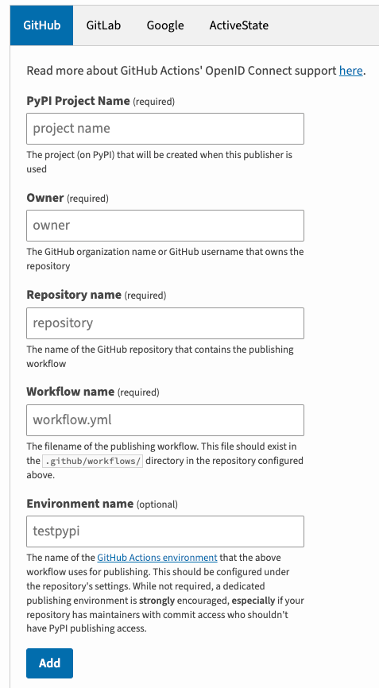

# Pypi Trusted Publisher Management and pitfalls

{ style="height:300px" align=right}
Be the cool kid on pypi, I thought, use the Trusted Publisher Management and OpenID Connect (OIDC)... I thought...

While working on my latest repo [convert_poetry2uv](https://pypi.org/project/convert-poetry2uv/), I wanted to automatically push the builds to pypi. Traditionally a username/password combination was used, which was later replaced by an API token. These days OIDC can be used, which I tried. I'm here to share some pitfalls, so hopefully you don't fall in them.

<!-- more -->

## The beginning
Let's start with the guides I followed:

[https://packaging.python.org/en/latest/guides/publishing-package-distribution-releases-using-github-actions-ci-cd-workflows/](https://packaging.python.org/en/latest/guides/publishing-package-distribution-releases-using-github-actions-ci-cd-workflows/
)

This is actually quite clear and will get you started quickly, with also good examples. I only changed the actions yaml a bit, to work with uv.

Another doc is by [pypi](https://pypi.org), [https://docs.pypi.org/trusted-publishers/creating-a-project-through-oidc/](https://docs.pypi.org/trusted-publishers/creating-a-project-through-oidc/)

So, let's start with which field needs to be what.

This is what is currently being used for my test flow, to push to [test.pypi.org](https://test.pypi.org).


/// caption
Create a new publisher
///

## Any caveats?

So what are the caveats, this looks simple enough, right?

### Typos
obviously!

### Project name
The next thing is the PyPi *Project Name*. This needs to match the name defined in your `pyproject.toml` (no underscore, but hyphens!). If it doesn't match you'll get 403 errors when trying to upload.

```html title="403 error"
  <title>403 Invalid API Token: OIDC scoped token is not valid for
    project 'poetry-to-uv', project-scoped token is not valid for project:
    'poetry-to-uv'</title>
    </head>
    <body>
      <h1>403 Invalid API Token: OIDC scoped token is not valid for project
    'poetry-to-uv', project-scoped token is not valid for project:
    'poetry-to-uv'</h1>
      Access was denied to this resource.<br/><br/>
    Invalid API Token: OIDC scoped token is not valid for project
    &#x27;poetry-to-uv&#x27;, project-scoped token is not valid for
    project: &#x27;poetry-to-uv&#x27;
```

> NOTE: this error still has the old project name, which was part of my original challenge

### "-" vs "_"
During my initial steps I also ran into a invalid-publisher. This is described on the [troubleshooting page](https://docs.pypi.org/trusted-publishers/troubleshooting/).

In my case, this was a mismatch between "_" and "-".

### Not a problem
Having a *repository name* different than the *project name* is not a problem, as long as they are specified correctly on the [pypi.org](https://pypi.org) publishing page.

## Example highlights

At the bottom of this article is my complete `publish-to-pypi.yml` workflow.

Here are some highlight on the snippets.

```markdown title="environment"
 publish-to-testpypi:
    name: Upload release to TestPyPI
    needs:
      - build
    runs-on: ubuntu-latest

    environment:
      name: testpypi
      url: https://test.pypi.org/p/convert-poetry2uv
```

Note the name of the environment, it matches the environment that is configured in the publisher on pypi.org.

```markdown title="repository-url"
 - name: Publish distribution 📦 to TestPyPI
        uses: pypa/gh-action-pypi-publish@release/v1
        with:
          repository-url: https://test.pypi.org/legacy/
          verbose: true
          skip-existing: true
```

For TestPyPi the *repository-url* needs to be set. I've set the *verbose* to true, so I was able to inspect my issues. The *skip-existing* flag is useful for testing on TestPyPi. It will not overwrite the existing file with the same version number, but it will not fail the pipeline either.


## Full example
For the full section below.

* Only push to pypi when a new tag is set

```markdown title="publish-to-pypi"
  publish-to-pypi:
    name: Publish Python 🐍 distribution 📦 to PyPI
    if: startsWith(github.ref, 'refs/tags/') # only publish to PyPI on tag pushes
```

* ${{ github.token }}, is automatically set. No need to worry about it.

```markdown
 - name: Create GitHub Release
    env:
      GITHUB_TOKEN: ${{ github.token }}
```

* With the upload to pypi successful, a release is created also on github.


```yaml title="publish-to-pypi.yml"
name: Publish to TestPyPI

on: push

jobs:
  build:
    name: Build distribution 📦
    runs-on: ubuntu-latest

    steps:
      - uses: actions/checkout@v4

      - name: Install uv
        uses: astral-sh/setup-uv@v5
        with:
          # Install a specific version of uv.
          version: "0.5.13"

      - name: Set up Python
        uses: actions/setup-python@v5
        with:
          python-version: "3.12"

      - name: build distribution
        run: uv build

      - name: Store the distribution packages
        uses: actions/upload-artifact@v4
        with:
          name: python-package-distributions
          path: dist/

  publish-to-testpypi:
    name: Upload release to TestPyPI
    needs:
      - build
    runs-on: ubuntu-latest

    environment:
      name: testpypi # (1)!
      url: https://test.pypi.org/p/convert-poetry2uv

    permissions:
      id-token: write # IMPORTANT: mandatory for trusted publishing

    steps:
      - name: Download all the dists
        uses: actions/download-artifact@v4
        with:
          name: python-package-distributions
          path: dist/
      - name: Publish distribution 📦 to TestPyPI
        uses: pypa/gh-action-pypi-publish@release/v1
        with:
          repository-url: https://test.pypi.org/legacy/
          verbose: true
          skip-existing: true

  publish-to-pypi:
    name: Publish Python 🐍 distribution 📦 to PyPI
    if: startsWith(github.ref, 'refs/tags/') # (3)! only publish to PyPI on tag pushes
    needs:
      - build
    runs-on: ubuntu-latest

    environment:
      name: pypi # (2)!
      url: https://pypi.org/p/convert-poetry2uv

    permissions:
      id-token: write # IMPORTANT: mandatory for trusted publishing

    steps:
      - name: Download all the dists
        uses: actions/download-artifact@v4
        with:
          name: python-package-distributions
          path: dist/
      - name: Publish distribution 📦 to PyPI
        uses: pypa/gh-action-pypi-publish@release/v1

  github-release:
    name: >-
      Sign the Python 🐍 distribution 📦 with Sigstore
      and upload them to GitHub Release
    needs:
      - publish-to-pypi
    runs-on: ubuntu-latest

    permissions:
      contents: write # IMPORTANT: mandatory for making GitHub Releases
      id-token: write # IMPORTANT: mandatory for sigstore

    steps:
      - name: Download all the dists
        uses: actions/download-artifact@v4
        with:
          name: python-package-distributions
          path: dist/
      - name: Sign the dists with Sigstore
        uses: sigstore/gh-action-sigstore-python@v3.0.0
        with:
          inputs: >-
            ./dist/*.tar.gz
            ./dist/*.whl
      - name: Create GitHub Release
        env:
          GITHUB_TOKEN: ${{ github.token }} # (4)!
        run: >-
          gh release create
          "$GITHUB_REF_NAME"
          --repo "$GITHUB_REPOSITORY"
          --notes ""
      - name: Upload artifact signatures to GitHub Release # (5)!
        env:
          GITHUB_TOKEN: ${{ github.token }}
        # Upload to GitHub Release using the `gh` CLI.
        # `dist/` contains the built packages, and the
        # sigstore-produced signatures and certificates.
        run: >-
          gh release upload
          "$GITHUB_REF_NAME" dist/**
          --repo "$GITHUB_REPOSITORY"
```

1.    Note the name of the environment, it matches the environment that is configured in the publisher on test.pypi.org.
2.    Note the name of the environment, it matches the environment that is configured in the publisher on pypi.org.
3.    Only push to pypi when a new tag is set
4.    ${{ github.token }}, is automatically set. No need to worry about it.
5.    With the upload to pypi successful, a release is created also on github


Have fun.
