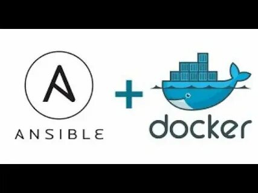

# Managing dockers using ansible on Synology NAS

{ style="width:230px" align=right}

Synology NAS devices are great and easy to use devices. The model I use is plenty strong to running a few containers as well. However, the Synology Docker application is not the best when it comes to managing multiple containers. It is a bit clunky and does not provide the flexibility I want.

Managing containers is very well possible using Ansible. Especially when you already use it for different systems and different tasks. Adding a playbook to allow you to update or manage your containers is a no-brainer.

<!-- more -->

Let's start with the setup, and leave synology aside for a moment.

I wanted to extend my playbook for updating my servers, including the containers running on them.

## The playbook

I have added the following part to my playbook:

```yaml
- name: Update docker compose
  hosts: dockerCompose
  become: true
  roles:
    - { role: docker_compose, tags: docker_compose }
```

This will run the `docker_compose` role on the `dockerCompose` hosts. The `become: true` allows the playbook to run with elevated privileges, which is required to manage docker containers.

## The hosts

The hosts are defined in my `hosts.yaml` file:

```yaml
dockerCompose:
  hosts:
    hostname1:
    hostname2:
```

## The role `docker_compose`

The role `docker_compose` is defined in my Ansible roles directory. The role contains the tasks to manage the docker containers, using the [docker_compose_v2 module](https://docs.ansible.com/ansible/latest/collections/community/docker/docker_compose_v2_module.html).
The `roles/docker_compose/tasks/main.yml` looks like this:

```yaml
---
- name: Update dockers
  become: true
  community.docker.docker_compose_v2:
    docker_cli: "{{ docker_cli | default(omit) }}"
    project_src: "{{ item.path }}"
    remove_orphans: true
    state: restarted
  loop: "{{ dockers }}"
```

This tasks will loop over the `dockers` variable, which is defined in the `hostvars`. This will have the paths to the docker compose files that need to be managed.

```yaml
dockers:
  - path: /path/to/project/holding/docker-compose_file
  - path: /path/to/project1/holding/docker-compose_file
  - path: /path/to/project2/holding/docker-compose_file
```

The `state: restarted` will ensure that the containers are restarted after pulling the latest images. The `remove_orphans: true` will remove any containers that are no longer defined in the docker compose file.

The `docker_cli` variable is optional and can be used to specify the docker CLI command to use. If not set, it will use the default `docker compose` command. For my synology I had to specify it.

Specify the `docker_cli` variable in the `host_vars` file for the Synology NAS:

```yaml
docker_cli: /usr/local/bin/docker
```

## Docker Compose Plugin

In the past, I had to do certain modifications to the synology python environment to be able to achieve this. Now I have modified the setup to use the compose plugin. Especially, that since 2022 the `docker-compose` command is deprecated and replaced by the `docker compose` command. The `community.docker.docker_compose_v2` module will use the newer `docker compose` command, based on the plugin.

This plugin needs to be installed on the Synology NAS. I have created the following task to install the plugin.

In the same role, `roles/docker_compose/tasks/synology.yml`:

```yaml
---
- name: Create a docker plugins directory
  ansible.builtin.file:
    path: "{{ docker_plugins_path }}"
    state: directory
    mode: "0755"

- name: Download docker compose plugin
  ansible.builtin.get_url:
    url: https://github.com/docker/compose/releases/download/{{ docker_compose_version }}/docker-compose-linux-x86_64
    dest: "{{ docker_plugins_path }}/docker-compose"
    mode: "0755"
```

The following are added to the `hostvars`:

```yaml
docker_compose_version: v2.37.1
docker_plugins_path: /usr/local/lib/docker/cli-plugins
```

## Playbook addition
To call this task, we add the following to the playbook, before calling the `docker_compose` role:

```yaml
- name: Docker compose for Synology hosts
  hosts: synology
  become: true
  tasks:
    - name: Include Synology tasks
      ansible.builtin.include_tasks: roles/docker_compose/tasks/synology.yml
```

## Conclusion
Using Ansible to manage docker containers on a Synology NAS is a great way to automate the management of your containers. It allows you to easily update and manage your containers, without having to use the Synology Docker application. The `community.docker.docker_compose_v2` module provides a simple way to manage your containers using the newer `docker compose` command, which is the recommended way to manage docker containers.

## Complete files

### update_servers.yaml playbook

```yaml
---
- name: Docker compose for Synology hosts
  hosts: synology
  become: true
  tasks:
    - name: Include Synology tasks
      ansible.builtin.include_tasks: roles/docker_compose/tasks/synology.yml

- name: Update docker compose
  hosts: dockerCompose
  become: true
  roles:
    - { role: docker_compose, tags: docker_compose }
```

### roles/docker_compose/tasks/main.yml

```yaml
---
- name: Install dependencies
  ansible.builtin.command:
    cmd: "{{ item.install_command }}"
    chdir: "{{ item.path }}"
  loop: "{{ dockers }}"
  when: item.install_command is defined
  register: my_output
  changed_when: my_output.rc != 0 # <- Uses the return code to define when the task has changed.
  become_user: "{{ user.name }}"
  become: true

- name: Update dockers
  become: true
  community.docker.docker_compose_v2:
    docker_cli: "{{ docker_cli | default(omit) }}"
    project_src: "{{ item.path }}"
    remove_orphans: true
    state: present
    ignore_build_events: false
  loop: "{{ dockers }}"
```
### roles/docker_compose/tasks/synology.yml

```yaml
---
- name: Create a docker plugins directory
  ansible.builtin.file:
    path: "{{ docker_plugins_path }}"
    state: directory
    mode: "0755"

- name: Download docker compose plugin
  ansible.builtin.get_url:
    url: https://github.com/docker/compose/releases/download/{{ docker_compose_version }}/docker-compose-linux-x86_64
    dest: "{{ docker_plugins_path }}/docker-compose"
    mode: "0755"
```

### host_vars/hostname1/main.yaml

```yaml
dockers:
  - path: /path/to/project/holding/docker-compose_file
  - path: /path/to/project1/holding/docker-compose_file
  - path: /path/to/project2/holding/docker-compose_file

docker_cli: /usr/local/bin/docker
docker_compose_version: v2.37.1
docker_plugins_path: /usr/local/lib/docker/cli-plugins
```

### hosts.yaml

```yaml
dockerCompose:
  hosts:
    hostname1:
    # hostname2:

synology:
  hosts:
    hostname1:
      ansible_host: 192.168.3.20
```
