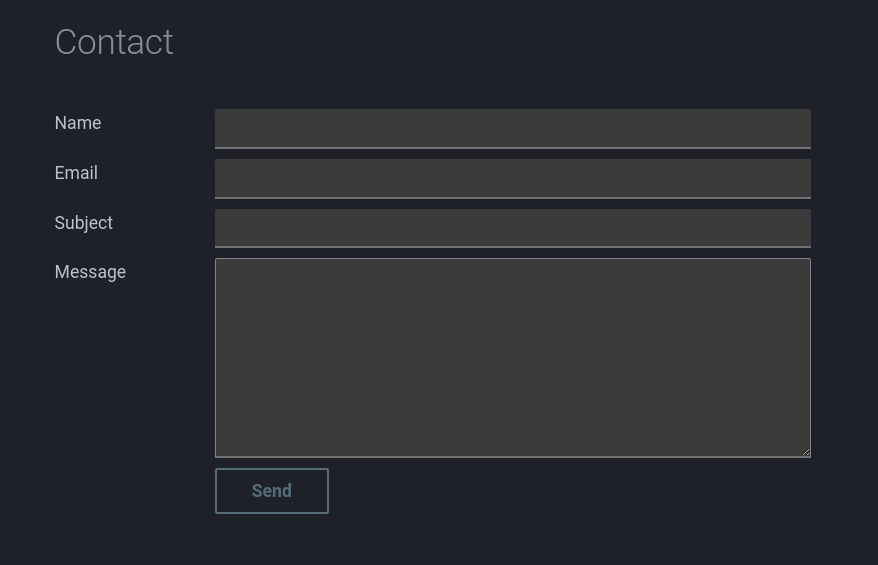

# Contact form made simple

{ style="height:300px" align=right}
Today I ran into a service that allows you to create a contact form without having to write a bunch of code. Making it really easy to incorporate it in your mkdocs website.

<!-- more -->

## Un-static forms

The service is called [Un-static](https://un-static.com) and it allows you to create a form by registering a form on their website. Essentially, you don't even need to create an account unless you need some additional features.

Once you create a form you can use the form's URL to submit the form. The form is submitted via a POST request and the form data is sent to the email address you specified when  the form was created.

The [how-to page](https://un-static.com/how-to/) on their website explains how to create a static form and how to use it.

### Example

Below is an example of a form that I created using Un-static in combination with Mkdocs.

```html title="docs/contact/index.md" linenums="1" hl_lines="10"
---
hide:
    - navigation
    - toc
---
<section>
  <div class="md-grid"
  style="max-width: 840px; margin-left: 0; display: flex; justify-content: left;">
    <form method="post"
    action="https://forms.un-static.com/forms/<form-id>"
    class="md-grid md-form"
    style="display: grid; grid-template-columns: 150px 2fr; gap: 10px; width: 100%;">
        <label for="name" class="md-text" style="text-align: left; padding-right: 10px;">Name</label>
        <input type="text" id="name" name="name" required class="md-input">

        <label for="email" class="md-text" style="text-align: left; padding-right: 10px;">Email</label>
        <input type="email" id="email" name="email" required class="md-input">

        <label for="subject" class="md-text" style="text-align: left; padding-right: 10px;">Subject</label>
        <input type="text" id="subject" name="subject" required class="md-input">

        <label for="message" class="md-text" style="text-align: left; padding-right: 10px;">Message</label>
        <textarea id="message" name="message" style="height: 200px;" class="md-input"></textarea>

        <div></div> <!-- Empty cell for spacing -->
        <button type="submit" class="md-button" style="width: fit-content; justify-self: start;">Send</button>
    </form>
  </div>
</section>
```

> The form ID is the ID of the form that was created on the Un-static website. The form ID is used in the form's action attribute. The form ID is unique to each form.


The form requires a return URL. This is the URL that the user is redirected to after the form is submitted. The return URL is specified when the form is created on the un-static website.


This can just be a simple thank you page. Below is an example of a thank you page.

```html title="docs/contact/mailsent.md"
---
hide:
    - navigation
    - toc
---
Your message has been sent
```

In order to not show the `mailsent` page in the navigation the navigation is hidden. I had set up the nav section in the `mkdocs.yml` like this:

```yaml title="mkdocs.yml"
nav:
  - Home: index.md
  - Blog:
      ...
  - Contact:
      - Contact: contact/index.md
      - Mail sent: contact/mailsent.md
```