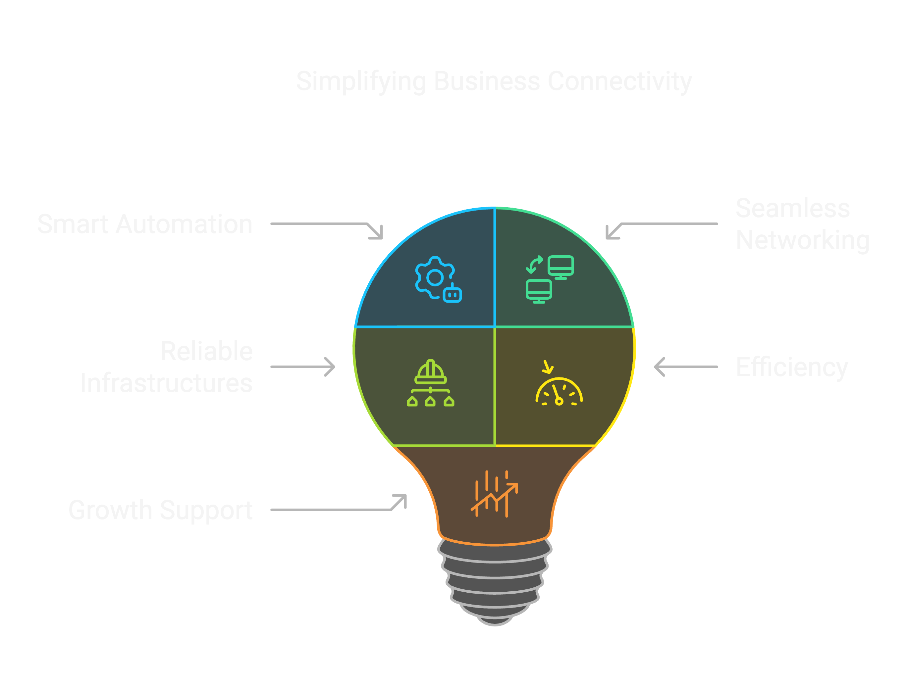

---
hide:
  - navigation
  - toc
---

# Dream networking and automation

At Dream networking and automation, we’re passionate about making business connectivity effortless through smart automation and seamless networking. We know that complex networks can be overwhelming, so we focus on simplifying on the process that help businesses run more efficiently, and give them room to grow. With innovative automation, we can help build reliable infrastructure that keep businesses running smoothly, minimize disruptions, and support new ideas in an ever-changing digital world.

## What can we do for you

Dream networking and automation is your trusted partner in transforming networking and automation challenges into strategic advantages. With years of experience in designing and implementing robust network automation solutions, we bring expertise, reliability, and a forward-thinking approach to every project. But it’s not just about technical excellence, it’s also about sharing knowledge, empowering your team, and fostering growth within your company.
We take the time to understand your unique needs, ensuring that our solutions not only enhance efficiency and security but also strengthen your team’s capabilities.
By partnering with us, we are committed to delivering customized solutions that support both immediate success and long-term innovation. Let’s build a smarter, more connected future together.

{ style="height:400px"}
