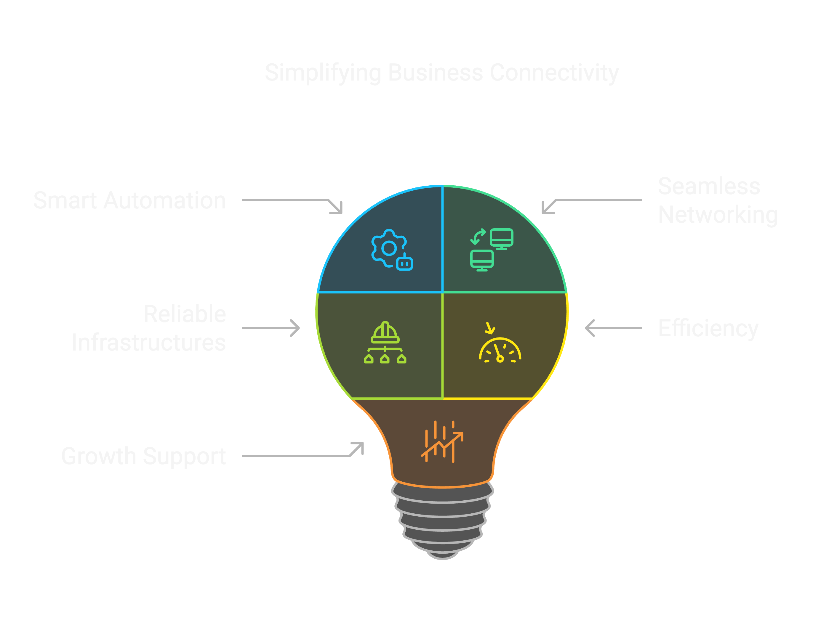

  <h1>Dream Networking & Automation</h1>
  
Transforming business connectivity through smart automation and seamless networking solutions. We make complex networks simple, efficient, and future-ready.

## What We Do

  

    🚀
    <h3>Network Automation</h3>
    
We design and implement robust network automation solutions that streamline your operations, reduce manual errors, and enhance efficiency across your entire infrastructure.

  

  

    🔧
    <h3>Infrastructure Design</h3>
    
Building reliable, scalable infrastructure that keeps your business running smoothly while supporting growth and innovation in an ever-changing digital landscape.

  

  

    📚
    <h3>Knowledge Transfer</h3>
    
We don't just implement solutions – we empower your team with the knowledge and skills needed to maintain and evolve your network infrastructure independently.

  

## Our Approach

Dream networking and automation is your trusted partner in transforming networking and automation challenges into strategic advantages. With years of experience in designing and implementing robust network automation solutions, we bring expertise, reliability, and a forward-thinking approach to every project.

But it's not just about technical excellence – it's also about sharing knowledge, empowering your team, and fostering growth within your company. We take the time to understand your unique needs, ensuring that our solutions not only enhance efficiency and security but also strengthen your team's capabilities.

By partnering with us, we are committed to delivering customized solutions that support both immediate success and long-term innovation.

{ .hero-image }

  <h2>Public Speaking & Knowledge Sharing</h2>
  
Sharing expertise and insights with the broader community through conference presentations and technical talks.

  

    <h4><a href="speaker/#bmp-going-beyond-show-commands-and-screen-scraping" target="_blank">BMP - Going beyond show commands and screen scraping</a></h4>
    

      <strong>Date:</strong> May 30, 2025 |
      <strong>Event:</strong>Autocon3 |
      <strong>Video:</strong> <a href="https://youtu.be/MgK2YSfTvD8" target="_blank">Watch Now</a>
    

    
Exploring the journey from screen scraping to modern BGP Monitoring Protocol (BMP) solutions. Learn about chosen architecture, challenges with BGP data volume, and practical implementation strategies for handling pre-policy BGP data.

  

  

    <h4><a href="speaker/#repos-are-like-children-parenting-101-pygrunn-2025" target="_blank">Repos are like children, parenting 101</a></h4>
    

      <strong>Date:</strong> May 16, 2025 |
      <strong>Event:</strong> PyGrunn |
      <strong>Video:</strong> <a href="https://www.youtube.com/watch?v=Kc8fDYP5cJU" target="_blank">Watch Now</a>
    

    
A unique perspective on project management through the lens of parenting. Discover how managing code repositories parallels raising children, from creation through maturity, with practical insights on nurturing healthy development practices.

  

  <h2>Ready to Transform Your Network?</h2>
  
Let's discuss how we can help streamline your networking and automation challenges.

  <a href="contact/" class="cta-button">Get In Touch</a>

