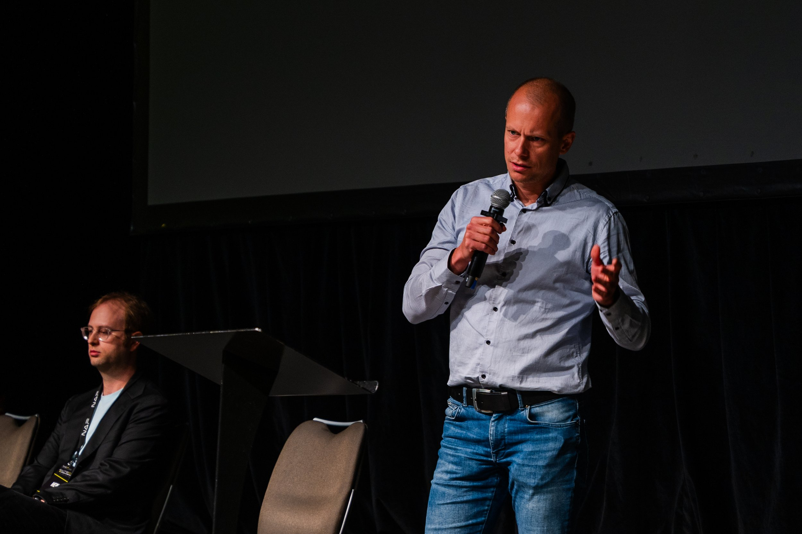
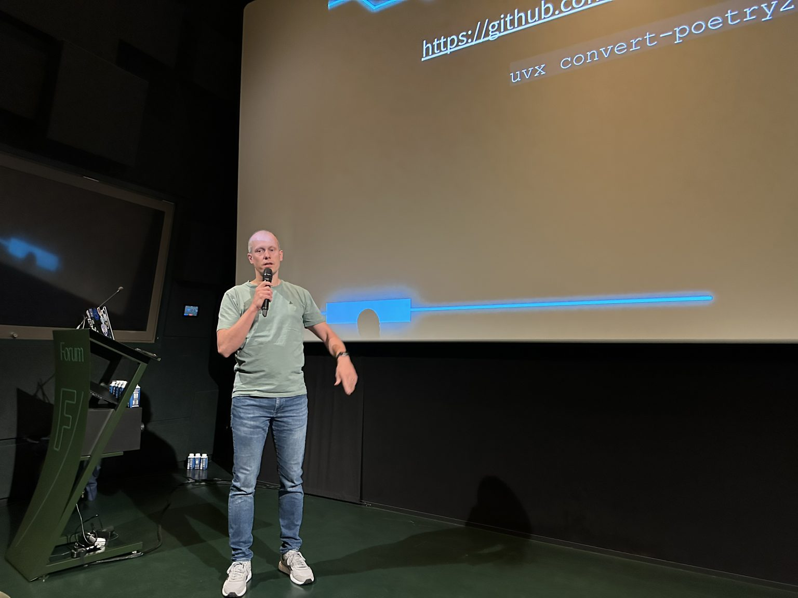
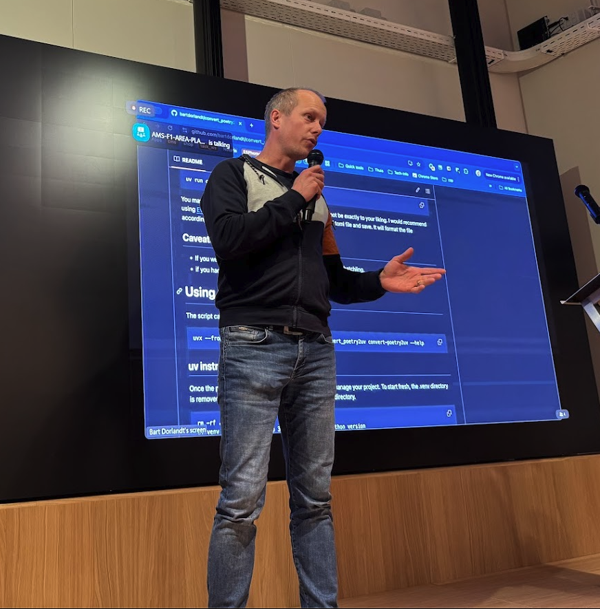
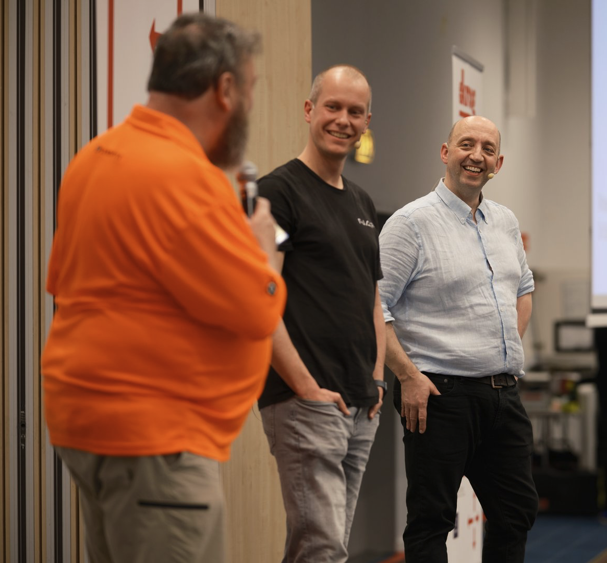
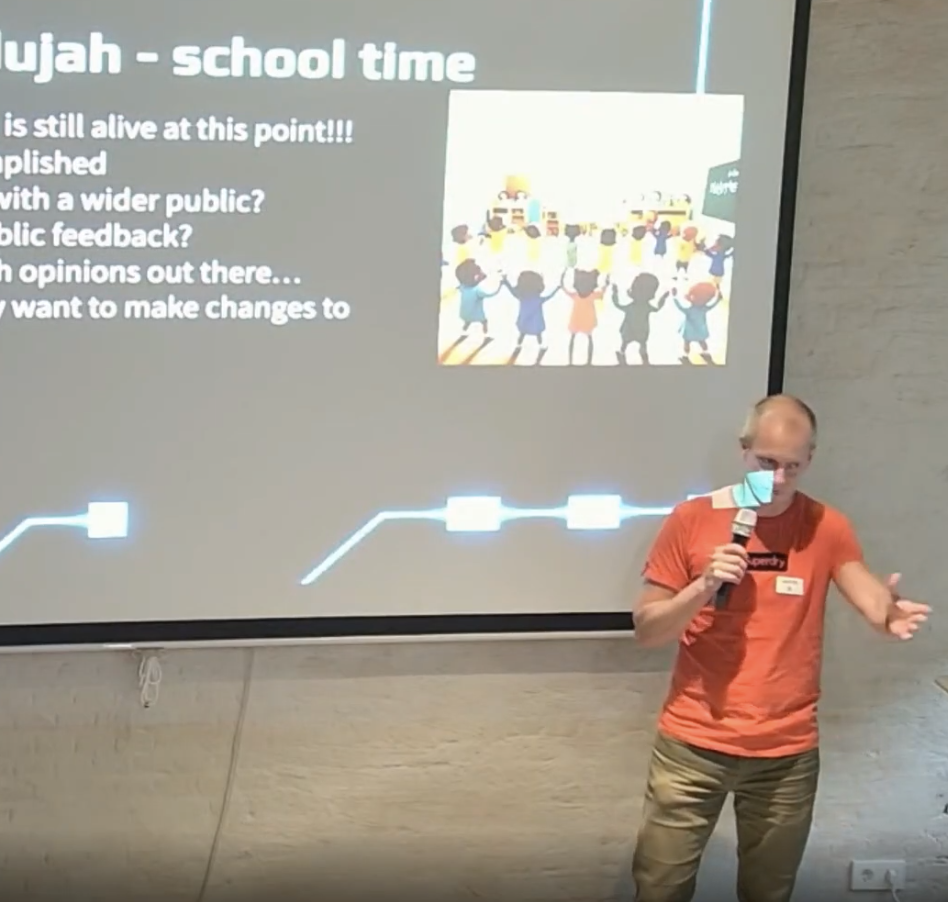

<!--  -->

# 🎤 Public speaking

## Presentations

### BMP - Going beyond show commands and screen scraping

* Date: 2025-05-30
* Location: [Autocon3](https://networkautomation.forum/autocon3/)
* Links:
    * [Video](https://youtu.be/MgK2YSfTvD8)

#### Description
{ style="height:350px" align=right}
With the automation around configuration generation and deployment already in place. It was the desire to present back to the customer that the BGP prefixes configured to be advertised were arrived as such. Though not only that, but also accepted through the policy.

I will take you on the journey from where some felt that screen scraping was a good idea, to the current solution using BMP (BGP Monitoring Protocol). The chosen architecture, the challenges faced with the amount of data that comes with BGP and how we dealt with them.

If you were looking on how to deal with your BGP data, especially your pre policy data, this should kickstart your adventure.

### Repos are like children, parenting 101 - PyGrunn 2025

* Date: 2025-05-16
* Location: [PyGrunn](https://pygrunn.org/)
* Links: [Video](https://www.youtube.com/watch?v=Kc8fDYP5cJU)

#### Description
{ style="height:350px" align=right}
For those without children, you might never have realized that having a project is much like a child. At the same, for those with children, you may never have the time or piece of mind to realize it.

I’ll take you through a walk of life on ‘creating’ your child(ren), how to deal with the early stages, and taking care of the rules and boundaries as these youngsters mature. How do you ensure that you raise a child to be proud of?

What happens when your child is going through different phases in life? Going from kindergarten, to school and beyond. How will he behave? Will he be overwhelmed by all the new info/data thrown at him?

And so, you become a proud parent and have the brilliant idea (or someone had an idea for you) of having another child. Do you leave it to fate that he will mature the same, or could you influence it in any way?

Would it be possible to provide our children the tools to take care of themselves?

For whoever got confused, we are still talking about repositories and code. ;)

### Convert Poetry to uv - lightning

* Date: 2025-03-27
* Location: [Py.Amsterdam](https://py.amsterdam/)
* Links: [Meetup](https://www.meetup.com/pyamsterdam/events/306556782/)

#### Description
{ style="height:350px" align=right}
During the python meetup there was room for some 5 minute lightning talks. I stepped up and shared my findings on poetry and uv, and the challenging with migrating from poetry to uv. Because of this challenge I've written a tool to help with that migration. Allowing to pass in the current pyproject.toml and convert it to uv.

The tool is hosted at github - [convert_poetry2uv](https://github.com/bartdorlandt/convert_poetry2uv/).

### The Tale of 2 Henrys and BMP

*What building cars can teach us about building software and BMP*

* Date: 2025-03-06
* Location: [DKNOG15](https://events.dknog.dk/event/32/)
* Links: [Video](https://youtu.be/e3OhlqFvwJg?si=JGmz8ATHulvWx-f5), [Slides](https://drive.google.com/file/d/1FrExg3i-Ieh9vLlQq4HXYCXLpS0W7Vzc/view)

#### Description
{ style="height:350px" align=right}
In the late 19th century, two industrial titans were born within a few months of each other but an ocean apart. Both of these men, Henry Royce and Henry Ford, were obsessed with precision engineering and, fortunately for many of us, cars. They focused on building the best motor cars possible, though they achieved their goals in very different ways: Royce was driven by perfection, Ford by production.

[Michael Daly](https://www.linkedin.com/in/michaeladaly/) (Senior Director of Engineering) and [Bart Dorlandt](https://www.linkedin.com/in/bartdorlandt/) (Senior Network Automation Engineer) are working at Imperva where they are undergoing a complete rewrite of the Automation platform and we are using some of the ideas that these engineers have taught us us.

This presentation will explore our vision for building better, more sustainable tools and discuss how the Network Automation team at Imperva is implementing these principles in our workflow.

From the technical side we zoom in on a recent project using BGP Monitoring Protocol (BMP). Where we previously had manual network verification, which improved to screen scraping, now having a push model from the router to a central database. This gives us an “offline” state and allows the customer to self verify their configured and advertised prefixes are accepted and learned as expected. This didn’t happen without challenges. We will share the pitfalls and the challenges and how we faced and overcame them.

### Repos are like children - PyUtrecht 2024

*parenting 101*

* Date: 2024-09-17
* Location: [PyUtrecht](https://www.meetup.com/pyutrecht/)
* Links: [Video](https://drive.google.com/file/d/1XomrwxB4OdmknrYf6MasjhGxZJgJEYNO/view) - starting at 34:00, [Slides](https://drive.google.com/file/d/1-jheUXSoFJyEim1-QCK4-CFoKSRMiZ9Z/view?usp=sharing)

#### Description
{ style="height:350px" align=right}
For those without children, you might never have realized that having a project is much like a child. At the same, for those with children, you may never have the time or piece of mind to realize it.

I’ll take you through a walk of life on ‘creating’ your child(ren), how to deal with the early stages, and taking care of the rules and boundaries as these youngsters mature. How do you ensure that you raise a child to be proud of?

What happens when your child is going through different phases in life? Going from kindergarten, to school and beyond. How will he behave? Will he be overwhelmed by all the new info/data thrown at him?

And so, you become a proud parent and have the brilliant idea (or someone had an idea for you) of having another child. Do you leave it to fate that he will mature the same, or could you influence it in any way?

Would it be possible to provide our children the tools to take care of themselves?

For whoever got confused, we are still talking about repositories and code. ;)

During the talk we reference the growth of the child to several aspects of growing your repository and code. We therefore touch on the following subjects:

* poetry, rye, uv
* ruff
* cookiecutter
* pytest
* pipelines
* coverage, though use it wisely

## Podcasts

### There Must Be a Better Way! - Network Automation Nerds

* Date: 2025-06-04
* Podcast: [Packet Pushers - Network Automation Nerds](https://packetpushers.net/podcasts/network-automation-nerds/nan093-network-automation-there-must-be-a-better-way/)
* Podcast links: [Apple podcast](https://podcasts.apple.com/us/podcast/network-automation-nerds/id1730980821), [Spotify](https://open.spotify.com/show/24feK9uvQNAMf71dHqAXBG), [Overcast](https://overcast.fm/itunes1730980821), [PocketCasts](https://pca.st/s8h382t3)

#### Description
{ style="height:350px" align=right}
*“There must be a better way!”* is guest Bart Dorlandt’s motto, which he applies to network automation, among other things. In today’s episode, Bart shares what he’s learned about network automation, explains why he focuses on process over tools, and reflects on the importance of mentorship. Bart and Eric also discuss why even if listeners aren’t working on big automation projects, they can still look for better ways to manage their networks.

* Links mentioned in the podcast:
    * [Convert Poetry to UV](https://github.com/bartdorlandt/convert_poetry2uv/)
    * [Convert Poetry to UV - PyPI](https://pypi.org/project/convert-poetry2uv/)
    * [Beyond the Makefile](https://github.com/bartdorlandt/Beyond_the_Makefile)
    * [Raymond Hettinger Youtube videos](https://www.youtube.com/results?search_query=+Raymond+Hettinger)
    * [Task](https://taskfile.dev/)

### Deploying the BGP Monitoring Protocol (BMP) at ISP Scale

* Date: 2024-11-13
* Podcast: [Packet Pushers - Heavy Networking](https://packetpushers.net/podcasts/heavy-networking/hn-759-deploying-the-bgp-monitoring-protocol-bmp-at-isp-scale/)
* Podcast links: [Apple podcast](https://podcasts.apple.com/us/podcast/heavy-networking/id370842767), [Spotify](https://open.spotify.com/show/7GlOoc33YmMT9j9hrvKH0y), [Overcast](https://overcast.fm/itunes370842767), [PocketCasts](https://pca.st/XOMu)

#### Description
{ style="height:350px" align=right}

The BGP Monitoring Protocol, or BMP, is an IETF standard. With BMP you can send BGP prefixes and updates from a router to a collector before any policy filters are applied. Once collected, you can analyze this routing data without any impact on the router itself. On today’s Heavy Networking, we talk with Bart Dorlandt, a network automation solutions architect. An ISP approached Bart with a use case for BMP, and he designed and built a solution to serve the ISP’s customers.

We discuss what BMP is good for, how it works, and why Bart needed to use BMP. We also get into the tools he used to build his solution, the architecture he designed, the challenges he ran into in dealing with millions of records, why Kafka was essential for scaling, and more.
